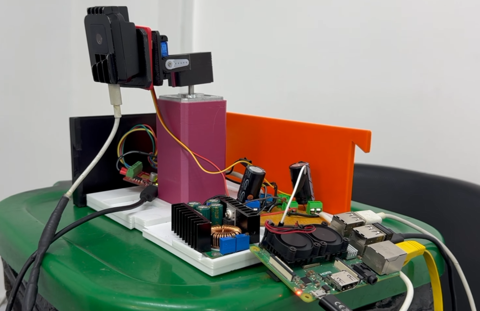
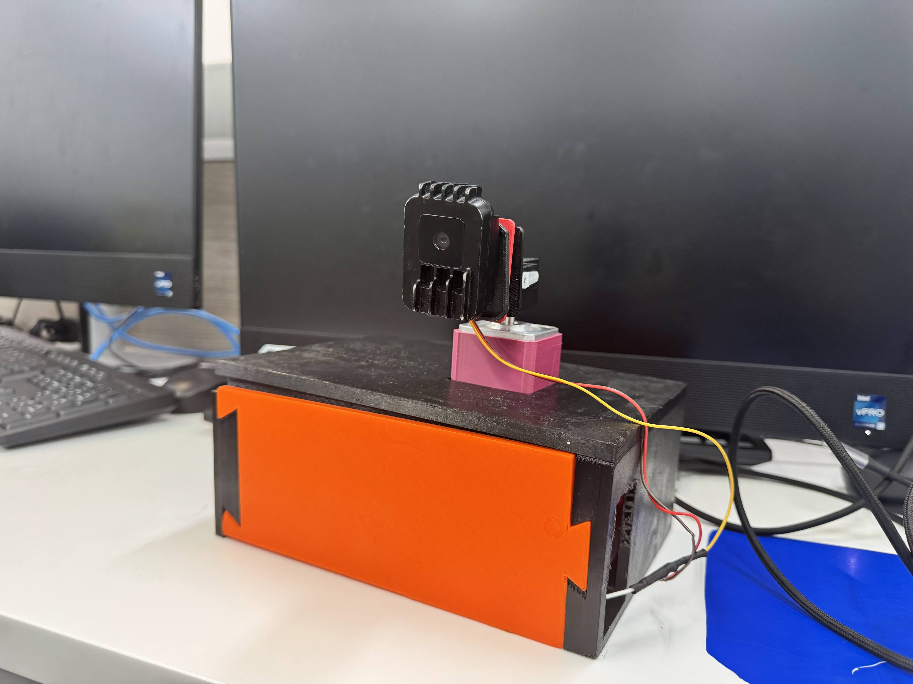
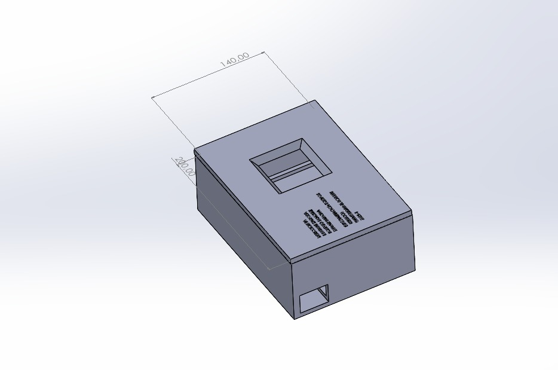
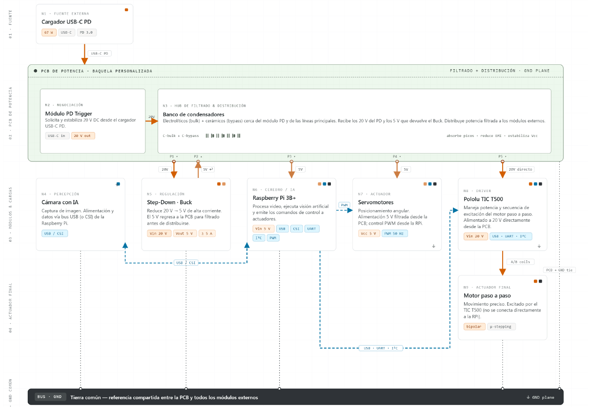
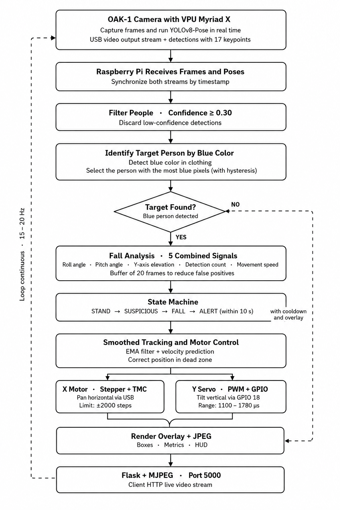

# Intelligent Patient Fall Detection System using Edge AI

> Edge AI-based intelligent patient monitoring platform developed using Raspberry Pi, Luxonis OAK-1, YOLOv8-Pose and real-time motorized tracking for automated fall detection in healthcare environments.



---

## Project Highlights

- Edge AI inference using Intel Myriad X VPU
- Real-time patient fall detection
- YOLOv8-Pose human pose estimation
- Raspberry Pi embedded Linux platform
- Automatic patient tracking
- Two-axis motorized camera control
- Multi-threaded software architecture
- CPU core affinity optimization
- Hardware-accelerated AI inference
- Flask live video streaming
- Fully local processing (No Cloud)

---

## Overview

This project presents an intelligent patient monitoring system capable of continuously tracking a selected patient and detecting fall events in real time.

Unlike conventional surveillance systems, all neural network inference is executed directly on the Intel Myriad X Vision Processing Unit (VPU) integrated into the Luxonis OAK-1 camera. This significantly reduces the computational load on the Raspberry Pi while preserving low latency and complete patient privacy.

The Raspberry Pi is therefore dedicated to system orchestration, task scheduling, motor control, communication, event analysis and live video streaming, allowing the complete platform to operate in real time.

The system automatically identifies the target patient, follows the patient's movement using a two-axis motorized platform, analyzes body posture, and generates alerts when a fall is detected.

---

## Key Features

- Edge AI inference using Luxonis OAK-1
- YOLOv8-Pose human pose estimation
- Raspberry Pi 3B+ embedded platform
- Automatic patient tracking
- Blue-shirt target identification
- Multi-signal fall detection
- Real-time motorized camera tracking
- Stepper motor pan control
- Servo tilt control
- Flask MJPEG live streaming
- Local AI processing without cloud dependency
- Embedded Linux software architecture

---

## Performance Optimization

The software architecture was specifically optimized to maximize the performance of the Raspberry Pi 3B+ while maintaining deterministic real-time behavior.

Several optimization techniques were implemented throughout the system:

- Multi-threaded processing pipeline
- CPU affinity assignment across Raspberry Pi CPU cores
- Parallel execution of image acquisition, AI inference, motor control and video streaming
- Non-blocking communication using synchronized queues
- Low-latency MJPEG streaming with Flask
- Overlay caching to minimize rendering overhead
- Frame lifetime management to prevent processing backlog
- Hardware AI inference offloaded to the Intel Myriad X VPU

These optimizations significantly reduce CPU contention, improve responsiveness and allow multiple real-time tasks to execute simultaneously without compromising system stability.

---

## Hardware Platform

- Raspberry Pi 3B+
- Luxonis OAK-1 Camera
- Intel Myriad X Vision Processing Unit
- NEMA17 Stepper Motor
- Pololu Tic T500 Motor Controller
- Servo Motor
- Custom Power Supply

---

## Software Stack

- Python 3.11
- OpenCV
- YOLOv8-Pose
- DepthAI SDK
- Flask
- NumPy
- Pigpio
- Raspberry Pi OS (Linux)

---

## Software Architecture

The application follows a modular and concurrent software architecture specifically designed for embedded Linux systems.

Independent execution threads are responsible for:

- Camera acquisition
- AI inference
- Patient identification
- Fall analysis
- Motor control
- MJPEG streaming
- Overlay rendering
- System monitoring

This modular architecture minimizes blocking operations, distributes computational workloads across multiple CPU cores, and provides a responsive real-time monitoring platform.

---

## Detection Pipeline

The monitoring pipeline consists of the following stages:

1. Image acquisition using the OAK-1 camera
2. YOLOv8-Pose inference executed on the Myriad X VPU
3. Human pose extraction
4. Blue-shirt identification
5. Target patient selection
6. Multi-signal fall analysis
7. State-machine evaluation
8. Motorized camera tracking
9. Live MJPEG video streaming

---

## Fall Detection Strategy

Instead of relying on a single detection criterion, the algorithm combines several biomechanical indicators to increase robustness and reduce false alarms.

The implemented features include:

- Body height ratio
- Spine angle estimation
- Body geometry analysis
- Descending velocity
- Immobility detection

A voting buffer combined with a finite state machine validates fall events before generating an alarm, significantly reducing false positive detections.

---

## Target Identification

Only a single patient is monitored at any given time.

Instead of applying color segmentation over the complete image, the system first extracts the torso region using YOLOv8 body keypoints. HSV segmentation is then applied only within this region to identify the patient wearing a blue shirt.

Additional temporal hysteresis maintains the patient's identity during brief occlusions, resulting in stable tracking and reduced false detections caused by background objects or nearby people.

---

## System Architecture

### Power Supply


---

### Hardware Assembly


---

### Final Prototype



---

### Enclosure



### Overall connection diagram



---

## Repository Structure

```text
.
├── Development/
├── Documentation/
├── Final/
├── Images/
├── README.md
```

---

## Future Improvements

Several enhancements are planned to further increase the system capabilities:

- Telegram notifications
- WhatsApp notifications
- Automatic video recording
- Event history database
- Audible emergency alarm
- Emergency acknowledgment button
- Voice interaction
- Infrared night vision
- Web-based monitoring dashboard
- Patient re-identification without color dependency
- Medical event logging
- Multi-camera support

---

## System Flowchart

The following flowchart summarizes the complete processing pipeline, including image acquisition, AI inference, patient identification, fall detection, motor control and live streaming.


---
## Final Demonstration

To see the final computer vision system in action, watch the following video:

[▶ Final_test_computer_vision.mp4](Images/Final_test_computer_vision.mp4)
---

## Documentation

- System Review
- Project Poster
- System Flowchart
- Hardware Documentation

---

## Author

**Roberto José Sánchez Orobio**

Electronic Engineer

Universidad El Bosque